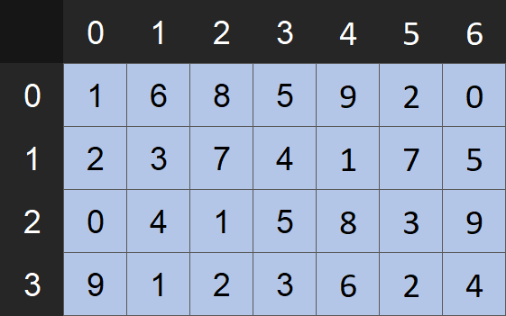

# Matrices Package

<div align="center">
  
  <p>0-based indexed 4 by 7 matrix</p>
</div>

This package implements a matrix by wrapping a class around a 2-dimensional list. Functions that are used within linear algebra, like scaling or transposing, is available for these matrix objects. As of now, only a handful of these functions are available (see documentation below).

## A Simple Example

```python
>>> from matrices import Matrix
>>> 
>>> # creating a matrix object
>>> m = Matrix([
...     [1, 6, 8, 5],
...     [2, 3, 7, 4],
...     [0, 4, 1, 5]
... ])
>>> 
>>> m
[1, 6, 8, 5]
[2, 3, 7, 4]
[0, 4, 1, 5]
>>> 
>>> m.m # number of rows
3
>>> m.n # number of columns
4
```

## Documentation

## License

[MIT](...)
